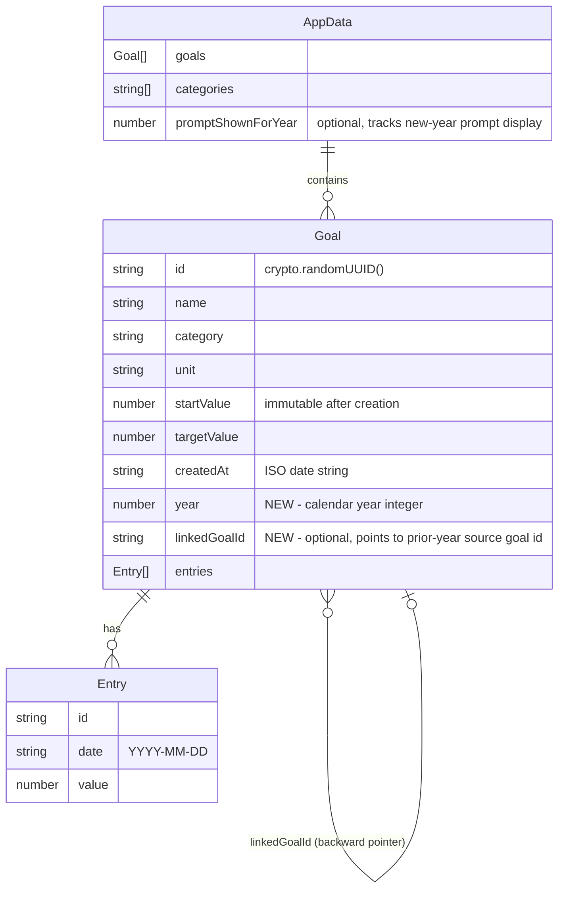

# feat: Goal Yearly Versioning

## Overview

Add a year dimension to goals so users can maintain distinct, year-scoped goal instances. Each calendar year is its own context — its own targets, its own entries, its own dashboard view — while an optional `linkedGoalId` ancestry chain enables cross-year comparison. A year picker in the top navigation bar drives the active year; past years are read-only; a carry-over prompt modal appears on first app load of a new year.

## Problem Statement

Users currently have a single flat list of goals with no concept of time boundaries. A goal like "Read 20 books" persists unchanged forever — there's no way to set a different target for a new year, compare performance year-over-year, or keep historical progress data separate from the current year's tracking.

## Proposed Solution

Minimal schema extension: add `year: number` (required) and `linkedGoalId?: string` (optional backward pointer) to `Goal`. Existing goals are backfilled: `year` derived from `goal.createdAt`. The `AppData` root gains a `promptShownForYear?: number` field to track when the new-year carry-over modal has been displayed.

An `activeYear` state (default: current calendar year) is added to `useAppData`. All goal queries in the dashboard filter by `activeYear`. The header gains a year-picker `Select` component. When `activeYear < currentYear`, all mutation controls are hidden (read-only mode). On first app load in a new calendar year, a modal prompts the user to select which of last year's goals to carry into the current year.

(see brainstorm: docs/brainstorms/2026-03-30-goal-yearly-versioning-brainstorm.md)

## Data Model Changes

### ERD — Updated Goal Shape

### Decision: `startValue` on carry-over

When a goal is copied forward, `startValue` is inherited verbatim from the source goal. The carry-over modal displays last year's final progress value so the user can set an informed `targetValue` before confirming. Users can edit `targetValue` in the modal. `startValue` can be changed after creation via `updateGoal` (the immutability guard in `vite.config.ts` is per-id — each carried-over goal has a new id).

### Decision: `promptShownForYear` detection

The new-year carry-over prompt fires when `currentYear > max(goal.year in data.goals)` AND `promptShownForYear !== currentYear`. It is set to `currentYear` the moment the modal is first displayed (persisted immediately). This ensures the prompt never re-appears, even if the user dismisses without carrying over goals.

### Decision: Chain traversal

`linkedGoalId` is a backward pointer only. Walking the chain is O(n) per step via a `Map<id, Goal>` lookup. For the history table on Goal Detail, we walk backward from the current goal recursively, stopping when `linkedGoalId` is `undefined` or the referenced goal is not found (handles deleted/orphaned goals gracefully).

### Decision: `activeYear` persistence

`activeYear` is React state only — it resets to `new Date().getFullYear()` on every app load. Users always open to the current year. Past years are browsed on demand via the picker.

---

## Technical Approach

### Architecture

The change is additive across four layers:

| Layer | Change |
|-------|--------|
| Types (`src/types.ts`) | Add `year`, `linkedGoalId` to `Goal`; add `promptShownForYear?` to `AppData` |
| API validator (`vite.config.ts`) | Extend `isValidGoal` to require `year: number`, allow optional `linkedGoalId: string` |
| State (`src/hooks/useAppData.ts`) | Add `activeYear`/`setActiveYear` state; add `carryForwardGoal` mutation; backfill logic on load |
| UI | Year picker in header, read-only mode in Dashboard/GoalCard, NewYearModal, history table in GoalDetail |

### Implementation Phases

#### Phase 1: Data Model + API + Backfill

**Goal:** Types are updated, API validates them, and existing `data.json` is auto-migrated on first load.

Files:
- `src/types.ts`
- `vite.config.ts`
- `src/hooks/useAppData.ts` (backfill + `carryForwardGoal`)

**Tasks:**

- [ ] `src/types.ts`: Add `year: number` and `linkedGoalId?: string` to `Goal`; add `promptShownForYear?: number` to `AppData`
- [ ] `vite.config.ts`: Update `isValidGoal` to require `year` (`typeof goal.year === 'number' && Number.isInteger(goal.year)`) and allow optional `linkedGoalId` (`goal.linkedGoalId === undefined || typeof goal.linkedGoalId === 'string'`)
- [ ] `src/hooks/useAppData.ts`: In the `load()` function, after `fetchData()`, backfill any goal missing `year` using `new Date(goal.createdAt).getFullYear()` (fallback: `new Date().getFullYear()`). If any goal was backfilled, call `saveData` immediately to persist the migration.
- [ ] `src/hooks/useAppData.ts`: Add `carryForwardGoal(source: Goal, overrides: { targetValue: number }): Promise<void>` — creates a new goal with `id: crypto.randomUUID()`, `year: activeYear`, `entries: []`, `linkedGoalId: source.id`, and all other fields from `source` (with `targetValue` from overrides). Calls `addGoal`.
- [ ] `data.json`: Manually verify seed goals have `year` after first dev server load

**Acceptance criteria:**
- [ ] TypeScript compiles with no errors after type changes
- [ ] `isValidGoal` accepts goals with `year` and optional `linkedGoalId`
- [ ] `isValidGoal` rejects goals without `year`
- [ ] On load, any goal missing `year` gets it backfilled and saved; subsequent loads skip the migration
- [ ] `carryForwardGoal` creates a new goal correctly linked to its source

---

#### Phase 2: `activeYear` State + Year Picker

**Goal:** Year state lives in context; year picker is in the nav bar; `Dashboard` filters goals by year.

Files:
- `src/hooks/useAppData.ts`
- `src/App.tsx`
- `src/components/Dashboard.tsx`
- `src/context/AppDataContext.tsx` (add `activeYear`, `setActiveYear`, `currentYear` to exported type if needed)

**Tasks:**

- [ ] `src/hooks/useAppData.ts`: Add `const [activeYear, setActiveYear] = useState(() => new Date().getFullYear())`. Add `activeYear` and `setActiveYear` to the `useMemo` deps array. Expose both in the returned object.
- [ ] `src/hooks/useAppData.ts`: Derive `availableYears: number[]` = sorted-descending unique union of `data.goals.map(g => g.year)` and `new Date().getFullYear()`. Expose it. No `useMemo` needed (React Compiler handles it).
- [ ] `src/App.tsx`: Refactor the `<header>` layout to `flex items-center justify-between` (or `relative` + absolutely-positioned picker). Import `useAppData` in `App.tsx` to access `activeYear`, `setActiveYear`, `availableYears`. Render a `<Select>` (from `src/components/ui/select.tsx`) in the header showing available years. When `availableYears.length <= 1`, optionally hide the picker (no years to switch between).
- [ ] `src/components/Dashboard.tsx`: Add `const { activeYear } = useAppData()`. Filter goals by year: `const yearGoals = goals.filter(g => g.year === activeYear)`. Apply the existing category filter on top of `yearGoals`. Remove the existing `useMemo` wrapper from `filteredGoals` — React Compiler manages memoization.
- [ ] `src/App.tsx` header: Show a "Read-only · [year]" badge or muted indicator when `activeYear < new Date().getFullYear()`.

**Acceptance criteria:**
- [ ] Year picker renders in the header with all years that have goals + current year
- [ ] Selecting a year from the picker updates the dashboard to show only that year's goals
- [ ] Selecting current year shows current goals and edit/delete controls
- [ ] `activeYear` resets to current year on page reload

---

#### Phase 3: Read-Only Mode

**Goal:** Past years have no create/edit/delete affordances in the UI.

Files:
- `src/components/Dashboard.tsx`
- `src/components/GoalCard.tsx`
- `src/App.tsx` (Quick Add FAB)

**Tasks:**

- [ ] `src/components/Dashboard.tsx`: Compute `const isCurrentYear = activeYear === new Date().getFullYear()`. When `!isCurrentYear`, omit `onEdit` and `onDelete` props from `<GoalCard>`. When `!isCurrentYear`, also hide the "New Goal" / "Create Goal" button. When `!isCurrentYear`, show a "Copy to [currentYear]" action on each `GoalCard` (pass `onCopyForward?: () => void` prop).
- [ ] `src/components/GoalCard.tsx`: Add optional `onCopyForward?: () => void` prop. When present, render a "Copy to [current year]" button (ghost/outline variant). This button is only passed when `!isCurrentYear` from Dashboard.
- [ ] `src/App.tsx`: Conditionally hide the Quick Add FAB when `activeYear < new Date().getFullYear()`.
- [ ] Wire `onCopyForward` in `Dashboard.tsx` to open `CreateGoalModal` in a new "carry forward" mode pre-filled with the source goal's fields (except `entries` and `year`), or open a lightweight `CarryForwardModal`.

**Acceptance criteria:**
- [ ] In past year view: no "New Goal" button, no edit/delete on GoalCards, no Quick Add FAB
- [ ] In past year view: each GoalCard shows "Copy to [currentYear]" button
- [ ] Clicking "Copy to [current year]" pre-fills the goal form with source goal data; user can adjust `targetValue` and `startValue`; submitting calls `carryForwardGoal`
- [ ] After carrying forward, `activeYear` switches to `currentYear` and the new goal is visible

---

#### Phase 4: New Year Carry-Over Modal

**Goal:** On first app load in a new calendar year, the user is prompted to select which prior-year goals to carry over.

Files:
- `src/components/NewYearModal.tsx` (new file)
- `src/hooks/useAppData.ts` (trigger logic)
- `src/App.tsx` (mount the modal)

**Tasks:**

- [ ] `src/hooks/useAppData.ts`: After backfill + load, compute `const currentYear = new Date().getFullYear()`. If `data.promptShownForYear !== currentYear` AND any goal exists in `currentYear - 1` year, set `showNewYearPrompt = true`. Immediately call `saveData({ ...data, promptShownForYear: currentYear })` to prevent repeat display. Expose `showNewYearPrompt: boolean` and `dismissNewYearPrompt(): void` from the hook.
- [ ] `src/components/NewYearModal.tsx`: A `Dialog`-based modal following the `CreateGoalModal` pattern (conditionally mounted). Props: `open: boolean`, `onClose: () => void`, `lastYearGoals: Goal[]`, `currentYear: number`. Renders a scrollable checklist (`max-h-[min(90vh,720px)] overflow-y-auto`) of last year's goals. Each row: goal name, category, last year's progress summary (final entry value vs target). A checkbox per goal (use a `<label>` + `<input type="checkbox">` pair styled with Tailwind — no Checkbox shadcn component exists). Below each checkbox row, a small inline input for `targetValue` (editable; pre-filled from source). "Carry Over Selected" submit button + "Skip" cancel button. On submit: call `carryForwardGoal` for each selected goal with the provided `targetValue`. On close/skip: just `onClose()`.
- [ ] `src/App.tsx`: `{showNewYearPrompt && lastYearGoals.length > 0 && <NewYearModal open onClose={dismissNewYearPrompt} lastYearGoals={lastYearGoals} currentYear={currentYear} />}`. Derive `lastYearGoals` from `data.goals.filter(g => g.year === currentYear - 1)`.
- [ ] Edge case: if `lastYearGoals.length === 0`, do not show the modal (brand new user or first use of versioning feature).

**Acceptance criteria:**
- [ ] Modal appears on first app load when transitioning to a new calendar year with prior-year goals
- [ ] Modal does NOT re-appear after being shown once (even if user refreshes without carrying over)
- [ ] User can check/uncheck individual goals
- [ ] User can edit `targetValue` for each goal in the modal before confirming
- [ ] Confirming creates copies of selected goals in `currentYear` with `linkedGoalId` set
- [ ] "Skip" closes modal without creating any goals
- [ ] After carry-over, user lands on current year dashboard with the new goals visible

---

#### Phase 5: Cross-Year History in Goal Detail

**Goal:** Goal Detail shows a history table for goals with a `linkedGoalId` chain.

Files:
- `src/utils/goalChain.ts` (new utility)
- `src/components/GoalDetail.tsx`

**Tasks:**

- [ ] `src/utils/goalChain.ts`: Export `buildGoalChain(goal: Goal, allGoals: Goal[]): Goal[]`. Walks backward via `linkedGoalId`, collecting each ancestor. Returns the chain oldest-first. Handles dangling references (goal not found → stop walking). Max chain depth: 50 (safety guard against circular references). Returns `[...ancestors, goal]`.
- [ ] `src/utils/goalChain.ts`: Export `getFinalEntryValue(goal: Goal): number | null`. Returns the `value` of the entry with the latest `date` (using `localeCompare`). Returns `null` if no entries.
- [ ] `src/components/GoalDetail.tsx`: Import `buildGoalChain`, `getFinalEntryValue`. Compute `const chain = buildGoalChain(goal, data.goals)`. If `chain.length <= 1` (no history), render nothing extra. If `chain.length > 1`, render a third `Card` below the entries list: "History across years" section.
- [ ] History table columns: Year | Target | Final Value | Progress %. Progress % = `(finalValue - goal.startValue) / (goal.targetValue - goal.startValue) * 100`. Guard against `targetValue === startValue` (division by zero → show "—"). Show "No data" if `finalValue === null`.
- [ ] Highlight the current goal's row as the active year.

**Acceptance criteria:**
- [ ] Goals with no chain (`linkedGoalId` undefined): no history section shown
- [ ] Goals with a 2-year chain: history table shows both years
- [ ] Deleted mid-chain goals are handled gracefully (chain stops at the break)
- [ ] Division by zero in progress % calculation is handled
- [ ] Goals with no entries show "No data" in the Final Value column

---

## System-Wide Impact

### Interaction Graph

1. `useAppData.load()` runs → backfill logic runs → `saveData()` if any goal was backfilled → `setData()` → all context consumers re-render
2. User selects year in header → `setActiveYear(year)` → `Dashboard` re-renders with filtered goals → `GoalCard` instances re-render
3. `carryForwardGoal()` → `addGoal()` → `mutate()` → `saveData()` + `setData()` → full re-render
4. `NewYearModal` confirms → multiple `carryForwardGoal()` calls → one `mutate()` per goal → sequential saves (consider batching if N is large)

### Error & Failure Propagation

- Backfill save failure: `mutate()` throws → caught by existing `error` state in `useAppData` → UI shows error toast. Next load will attempt backfill again (graceful retry).
- `carryForwardGoal` failure: `addGoal` throws → toast shown. Partial carry-over (if N goals were selected and failure occurs mid-loop) leaves the user with some goals copied. Mitigation: batch all `addGoal` calls into a single `mutate` with all new goals added at once.
- API validation failure after adding `year` to `isValidGoal`: existing goals without `year` would fail the validator. **Critical:** the backfill must run and `saveData` must succeed before any POST that includes those goals.

### State Lifecycle Risks

- `promptShownForYear` is saved optimistically (before user interacts with modal). If `saveData` fails, the modal won't re-appear. Acceptable trade-off — better than infinite re-display.
- `activeYear` in component state: switching to a past year and then creating a goal via Quick Add is naturally prevented by hiding the FAB. However, if the URL is navigated to `/goal/:id` for a past-year goal, the entry add form is in `GoalDetail`. Entries should be blocked there too — add a guard in `GoalDetail.tsx` based on `goal.year < currentYear`.

### API Surface Parity

- `isValidGoal` in `vite.config.ts` is the single validation point for all goal writes. It must be updated atomically with the type changes.
- `updateGoal`'s `Pick<Goal, ...>` in `useAppData.ts` does not include `year` or `linkedGoalId`. These fields should not be editable post-creation (similar to `id` and `createdAt`). Leave them out of `updateGoal`.

### Integration Test Scenarios

1. Fresh install, no prior data → app loads → no new-year modal → current year dashboard (empty state)
2. Existing data, all goals have `createdAt` in 2026, app loads in 2026 → no backfill needed → goals display for 2026
3. Existing data with goals from 2025 (no `year` field), app loads in 2026 → backfill runs → all 2025 goals get `year: 2025` → saved → new-year modal appears → user carries over 2 goals → 2 new 2026 goals created with `linkedGoalId`
4. User views 2025 via picker → edit/delete/create controls hidden → "Copy to 2026" button visible on each card
5. User opens goal detail for a 2026 goal with `linkedGoalId` → history table shows 2025 and 2026 rows

---

## Acceptance Criteria

### Functional

- [ ] `Goal` type has `year: number` (required) and `linkedGoalId?: string` (optional)
- [ ] `AppData` type has `promptShownForYear?: number`
- [ ] Existing goals in `data.json` are auto-backfilled with `year` on first load
- [ ] Dashboard shows only goals for `activeYear`
- [ ] Year picker in the header shows all years with goals + current year, sorted descending
- [ ] Selecting a year from picker updates the dashboard immediately
- [ ] Past years (`activeYear < currentYear`) are fully read-only (no create/edit/delete/add-entry)
- [ ] Past year GoalCards show a "Copy to [currentYear]" action
- [ ] Copy-forward creates a new goal in `currentYear` with `linkedGoalId` = source goal id and empty `entries`
- [ ] New-year carry-over modal appears on first app load of a new calendar year (with prior-year goals)
- [ ] Carry-over modal never re-appears after being shown once
- [ ] Carry-over modal shows prior-year goals with their progress, checkboxes, and editable `targetValue`
- [ ] Carrying over creates correctly linked new goals
- [ ] Goal Detail shows cross-year history table for goals with a `linkedGoalId` chain
- [ ] History table handles missing/deleted chain nodes gracefully

### Non-Functional

- [ ] No `useMemo`/`useCallback`/`React.memo` added (React Compiler is active)
- [ ] TypeScript strict mode: no `any`, proper `import type` for type-only imports
- [ ] New modal is conditionally mounted, not rendered with `open={false}`
- [ ] `verbatimModuleSyntax`: all type-only imports use `import type`
- [ ] No console errors or warnings in the browser
- [ ] `isValidGoal` updated atomically with type changes (no window where valid data fails validation)

---

## Dependencies & Risks

| Risk | Likelihood | Impact | Mitigation |
|------|-----------|--------|-----------|
| Backfill races with first `saveData` | Low | High | Backfill is synchronous in-memory; one atomic write after all goals are patched |
| `isValidGoal` update out of sync with type changes | Low | High | Update both in the same commit; add manual test |
| Partial carry-over on multi-goal save failure | Low | Medium | Batch all `addGoal` calls into a single `mutate` call |
| Year picker renders before data loads | Low | Low | `availableYears` defaults to `[currentYear]` when `data` is null |
| Circular `linkedGoalId` references | Very Low | Low | Max chain depth guard of 50 in `buildGoalChain` |

---

## Future Considerations (Out of Scope)

- Future year planning (setting goals for upcoming years)
- Goal template library separate from yearly instances
- Bulk year management / delete all goals for a year
- Year-level analytics dashboard
- Manual "link existing goals" feature (for goals created before versioning was added that aren't linked)
- Retroactive entry logging for past years
- URL-based year param for deep-linking to a specific year

---

## Sources & References

### Origin

- **Brainstorm document:** [docs/brainstorms/2026-03-30-goal-yearly-versioning-brainstorm.md](../brainstorms/2026-03-30-goal-yearly-versioning-brainstorm.md)
  - Key decisions carried forward: (1) `year` field + `linkedGoalId` on Goal (minimal schema change), (2) year picker in top nav bar, (3) past years are read-only, (4) new-year prompt modal, (5) linked goals enable cross-year comparison

### Internal References

- Types: `src/types.ts:1-21`
- API validator: `vite.config.ts:28-44`
- State hook: `src/hooks/useAppData.ts`
- Dashboard filter pattern: `src/components/Dashboard.tsx:19-30`
- Modal pattern: `src/components/CreateGoalModal.tsx:156-170`
- GoalDetail chart section: `src/components/GoalDetail.tsx:202-250`
- Progress utils: `src/utils/progress.ts`
- Context: `src/context/AppDataContext.tsx`

### Related Work

- Previous plan: [docs/plans/2026-03-14-001-feat-goal-progress-tracker-plan.md](2026-03-14-001-feat-goal-progress-tracker-plan.md)
- Previous plan: [docs/plans/2026-03-17-001-feat-dashboard-grid-filter-plan.md](2026-03-17-001-feat-dashboard-grid-filter-plan.md)
- Institutional learnings: [docs/solutions/feature-implementation/goal-crud-operations-and-code-review-fixes.md](../solutions/feature-implementation/goal-crud-operations-and-code-review-fixes.md)
- Institutional learnings: [docs/solutions/configuration-errors/vite-configureserver-plugin-architecture.md](../solutions/configuration-errors/vite-configureserver-plugin-architecture.md)
